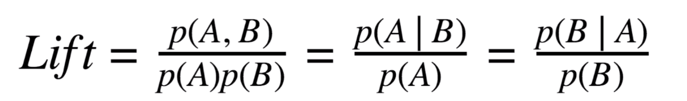
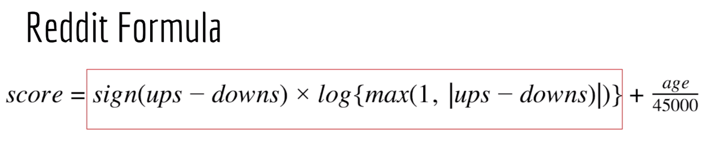
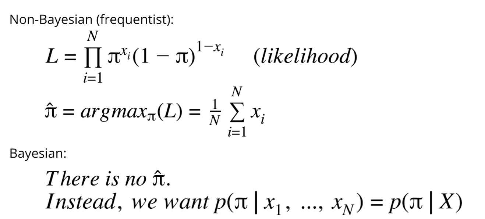
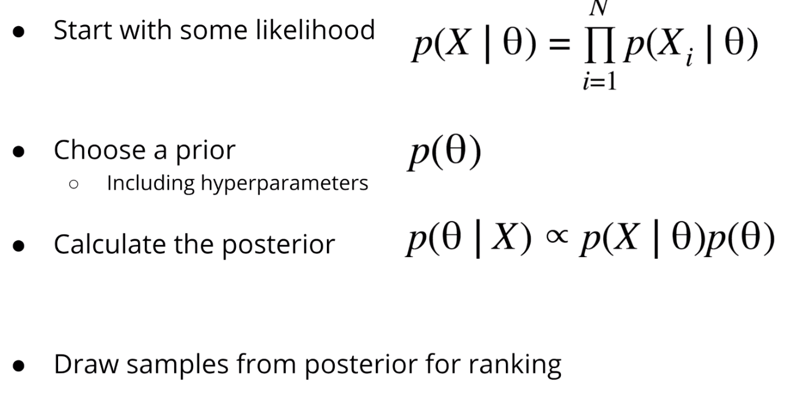

We need to show recommendations to new users, regardless what we know about them.

We can leverage the population's behavior to make suggestions are new users.

In many examples, no machine learning is required.

Strategies include:
- popularity scores
- recency and popularity over time
- weighted averages
- Bayesian paradigm for confidence
- explore/exploit dilemma
- supervised learning
- Markov models

### Popularity

- other people really liked it, so you probably will too
- McDonald's is popular, should we recommend that? Probably not
- top 40 music is popular, but many people won't like it
- age can be an important factor to consider, we should usually consider this
- news from last week is popular, but we don't want to see old news

### Context-Based

- also known as Product Associations or Frequent Item Sets
- if you're buying an iPhone, you may also want an iPhone case

- can try to compare count(A,B)/count(B), which can be rewritten as P(A | B)
- this doesn't always work, we can do better with Lift. Lift is the probability that A and B are bought together, divider by the individual probabilities P(A) and P(B). If A and B are independent, you will just get 1. If buying B makes buying A more likely, you will get a Lift > 1.

### Hacker News - Popularity Over Time

- Hacker News formula considers up votes, down votes, age, and penalties
- numerator is a measure of article popularity
- denominator is the age raised to 1.8, e.g. gravity decreases score over time
- penalty terms include self-posts or controversial posts
- numerator exponent 0.8 < denominator exponent 1.8 - this allows age to overpower popularity, driving newer articles to the top
- numerator exponent 0.8 < 1, so popularity score grows sublinearly. This is by design, because very few articles make up most of the votes, and many articles get just a few votes
- sublinear growth of popularity is also used by Reddit

### Reddit Ranking Algorithm

- unlike Hacker News, all users have equal credit to upvote/downvote
- similar idea of diminishing returns achieved using logarithmic scoring - the first 100 votes is worth more than 100 votes after 1000 votes
- the sign component allows positive and negative scores. The more downvotes you receive, the more the score will decrease
- age (time in seconds since inception) component adds to total score over time, i.e. scores will increase monotonically over time

### Problems with Average Ratings

- more complicated than upvote/downvote, can have 5 start ratings or other rating techniques
- what is easiest way to score items based on ratings - take the average?
- we must consider the confidence in our average. As the total number of ratings increases, the estimated average will approach expected average with high confidence
- our rankings will be more reliable if we compute confidence intervals for ratings and always use the lower bound
- popularity will increase score by creating tighter confidence intervals

- 5 star ratings can leverage Wilson's interval
- we can convert each possible rating to a upvote and downvote percentage, e.g. 0 star is 1 downvote 0 upvote, 3 star is 0.5 downvote and 0.5 upvote, and 5 star is 0 downvotes and 1 upvote

- what if there are 0 ratings? We need to use smoothing to prevent divide by 0
- this is common solution, also used in NLP
- this allows us to obtain smooth transition as number of voters increases

### Explore-Exploit Dilemma

- if you're at casino and there is row of slot machines, you can't tell which one is the best
- you must play them to see which one has best rewards
- you need to calculate the win rate for each slot machine
- how many times should you play each slot machine?
  - if you play too few, your estimate will have large confidence interval
  - if you play too many, you are missing opportunity to explore other machines

- explore-exploit is a challenge of recommenders
- exploration is needed to encourage new, novel items
- exploring too much runs the risk of bad recommendations, but not exploring can be a bad user experience

- Bayesian approach to explore-exploit example and how to model the win rate as a random variable
- posterior is proportional to the likelihood times the prior
- naturally, as we select more examples the posterior becomes more accurate and confidence interval becomes smaller
- for each item, scores are taken from the posterior sample. Over time the ranking will focus in on actual mean
- sampling the posterir is intelligently random, but it accounts for data we've already collected

